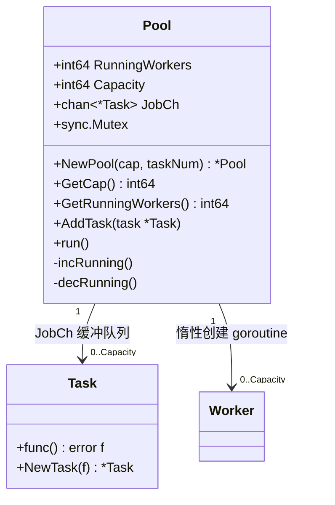
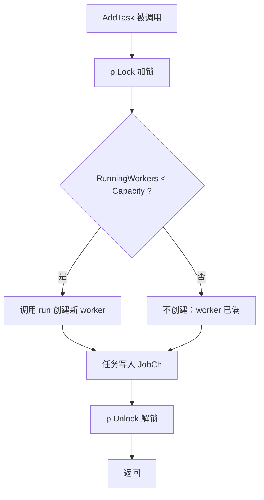
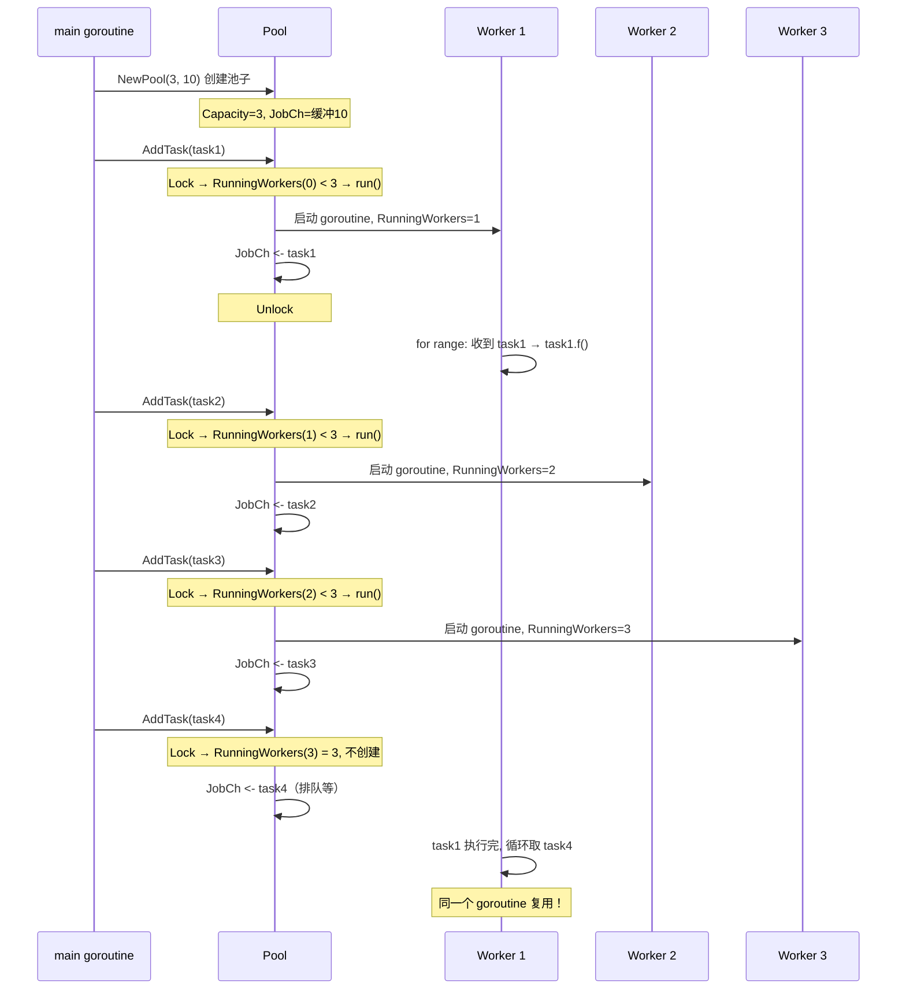

# 协程池：Goroutine Pool 设计与实现

## 这一章要记住什么

- 协程池的**核心思想**是复用 goroutine——用固定数量的 worker 处理无限多的任务，避免无限制创建 goroutine 导致内存暴涨和调度压力
- **惰性创建**：worker 不是预先启动的，而是在有任务时才按需创建，直到达到容量上限
- **缓冲 channel 是任务队列**：容量决定了能积压多少等待处理的任务；满了之后生产者阻塞，形成背压
- **原子操作 + 互斥锁配合**：`RunningWorkers` 用 atomic 读（低开销），`AddTask` 的"检查-创建"用 Mutex 保护临界区
- **每个 worker 是永久 goroutine**——用 `for range channel` 持续取任务，channel 是它的生命线

---

## 0. 为什么需要协程池：问题背景

### 没有协程池的世界

```go
// ❌ 无限制创建 goroutine
for _, task := range tasks {        // 假设有 10 万个任务
    go func(t Task) {
        t.Execute()                // 每个任务都创建一个新 goroutine
    }(task)
}
```

这会带来三个问题：

| 问题 | 说明 |
|------|------|
| **内存暴涨** | 每个 goroutine 初始栈 2KB，10 万个就是 200MB 起，外加调度器元数据 |
| **调度压力** | Go 运行时要在成千上万个 goroutine 之间切换，调度开销吃掉 CPU |
| **不可控** | 没法限制并发数量——如果任务里要调第三方 API，可能瞬间打爆下游 |

### 协程池的思路

```
把 goroutine 当成"工人"，任务当成"活儿"：

  ┌─────────────────────────────────────┐
  │              任务队列                │
  │  [task1][task2][task3][task4]...    │  ← 缓冲 channel
  └──────────┬──────────────────────────┘
             │
    ┌────────┼────────┬────────┐
    ▼        ▼        ▼        ▼
  worker1  worker2  worker3  (最多 Capacity 个)
    │        │        │
    ▼        ▼        ▼
  干活     干活     干活

worker 干完一个任务，立刻从队列取下一个——不用反复创建和销毁 goroutine
```

---

## 1. 架构总览：类型与关系

### 核心类型

代码里定义了两种类型：

```go
// Task —— 一个任务
type Task struct {
    f func() error   // 具体要执行的逻辑
}

// Pool —— 协程池
type Pool struct {
    RunningWorkers int64        // 当前正在运行的 worker 数量（atomic）
    Capacity       int64        // 最多允许多少个 worker
    JobCh          chan *Task   // 任务队列（缓冲 channel）
    sync.Mutex                 // 保护 AddTask 中的"检查-创建"临界区
}
```

### 类型关系图



Pool 和 Task 的关系是**松耦合**的——Pool 只管从 `JobCh` 里取 `*Task` 然后调用 `task.f()`，不关心 Task 内部是什么逻辑。

---

## 2. 逐层拆解：每个类型和方法的设计意图

### 2.1 Task —— 为什么把函数包装成结构体

**类型定义：**

```go
type Task struct {
    f func() error
}
```

**构造函数：**

```go
func NewTask(funcArg func() error) *Task
```

| 项目 | 说明 |
|------|------|
| 参数 | `funcArg`: 无参、返回 error 的函数 |
| 返回值 | `*Task`，包装后的任务对象 |

**为什么不直接用 `func() error`，而要套一层 `Task` 结构体？**

```go
// 方案 A：直接传函数
ch := make(chan func() error, 10)
ch <- myFunc

// 方案 B：包装成 Task（代码的方式）
ch := make(chan *Task, 10)
ch <- NewTask(myFunc)
```

现在的代码里 `Task` 只包了一个函数字段，看起来多此一举。但这是为**扩展留空间**：

```go
// 未来可以这样扩展，不影响 Pool 的代码：
type Task struct {
    f       func() error
    ID      string        // 任务 ID，用于追踪
    Timeout time.Duration // 单个任务的超时时间
    Retry   int           // 失败重试次数
    Ctx     context.Context
}
```

把任务抽象成结构体，后续加字段、加方法都不会改动 Pool 的签名。这是**面向接口/类型抽象**的思想。

### 2.2 Pool —— 池子的核心结构

**构造函数：**

```go
func NewPool(cap int64, taskNum int) *Pool
```

| 参数 | 说明 |
|------|------|
| `cap` | worker 数量上限，最多同时运行 `cap` 个 goroutine |
| `taskNum` | 任务队列缓冲大小，最多积压 `taskNum` 个等待任务 |
| 返回值 | `*Pool`，初始化好的池子 |

```
NewPool(3, 10) 的含义：

Capacity = 3          → 最多 3 个 worker 同时干活
JobCh = make(chan, 10) → 最多积压 10 个任务在队列里等

极端情况：3 个 worker 都在忙，队列里还排了 10 个任务
→ 第 14 个任务 AddTask 时，生产者会阻塞住
```

**为什么 Capacity 和 taskNum 是分开的？**

```
Capacity（并发度）     → 控制 CPU/内存消耗（有多少 goroutine 在跑）
taskNum（队列深度）   → 控制内存消耗（有多少任务结构体在排队）

两者影响不同的资源：
  Capacity=1, taskNum=10000  → 4MB goroutine 开销 + 大量内存积压任务
  Capacity=100, taskNum=10   → 400KB goroutine 开销 + 小队列，高频调度
```

### 2.3 RunningWorkers —— 为什么用 atomic 而不是 Mutex 保护

```go
RunningWorkers int64  // 标记为 atomic 操作
```

`RunningWorkers` 被两条路径访问：

| 操作 | 函数 | 频率 |
|------|------|------|
| 读 | `GetRunningWorkers()`、`AddTask()` | 每次 AddTask 都读 |
| 写 | `incRunning()`、`decRunning()` | 只在创建/销毁 worker 时写 |

**读远多于写**。如果用 Mutex，每次查"还能不能建新 worker"都要加锁——而 atomic 的 `LoadInt64` 只是一条 CPU 指令。

```go
// atomic 读写
func (p *Pool) incRunning() {
    atomic.AddInt64(&p.RunningWorkers, 1)
}
func (p *Pool) decRunning() {
    atomic.AddInt64(&p.RunningWorkers, -1)
}
func (p *Pool) GetRunningWorkers() int64 {
    return atomic.LoadInt64(&p.RunningWorkers)
}
```

### 2.4 sync.Mutex —— 保护什么？为什么不保护全部？

Pool 里嵌入了 `sync.Mutex`，但**只保护 `AddTask` 中的"检查 worker 数 → 创建 worker"这段临界区**：

```go
func (p *Pool) AddTask(task *Task) {
    p.Lock()
    defer p.Unlock()

    if p.GetRunningWorkers() < p.GetCap() {   // 检查
        p.run()                                 // 创建
    }

    p.JobCh <- task                             // 投递任务
}
```

为什么这段必须加锁？考虑两个 goroutine 同时 AddTask，且当前 RunningWorkers=2, Capacity=3：

```
不加锁的情况（数据竞争）：
  goroutine A: 读 RunningWorkers → 2 < 3 → 决定创建 worker
  goroutine B: 读 RunningWorkers → 2 < 3 → 也决定创建 worker
  → 两个都创建了，最终 RunningWorkers 可能变成 4（超出 Capacity）

加锁后：
  goroutine A: Lock → 读(2<3) → 创建 worker(RunningWorkers=3) → Unlock
  goroutine B: Lock → 读(3<3) → 不创建 → Unlock
  → 严格不超过 Capacity
```

投递任务 `p.JobCh <- task` 不需要保护——channel 本身就是并发安全的。

---

## 3. 核心流程：任务是怎么被执行的

### 3.1 run() —— 创建 worker 的方法

```go
func (p *Pool) run() {
    p.incRunning()                    // ① 原子 +1
    go func() {
        defer func() {
            p.decRunning()            // ④ worker 退出时原子 -1
        }()

        for task := range p.JobCh {   // ② 循环从 channel 取任务
            task.f()                  // ③ 执行任务
        }
    }()
}
```

**流程拆解：**

```
run() 被调用（已持有锁）
  │
  ├─ ① incRunning() → RunningWorkers +1
  │
  ├─ ② 启动 goroutine（立即返回，不阻塞 AddTask）
  │
  └─ 后台 goroutine 启动后：
       ┌──────────────────────────────────┐
       │ for task := range p.JobCh {      │  ← 阻塞等待任务
       │     task.f()                     │  ← 执行
       │ }                                │  ← 循环回第一步
       └──────────────────────────────────┘
       JobCh 被 close 后，range 退出 → defer decRunning() 执行 → RunningWorkers -1
```

**设计要点：**

- `run()` 启动 goroutine 后**立刻返回**——AddTask 不会被 worker 的启动阻塞
- worker 用 `for range` 循环——只要 JobCh 没关闭，worker 就一直活着，处理完一个任务立刻取下一个
- `defer decRunning()` 保证不管怎么退出都会减计数

### 3.2 AddTask() —— 投递任务的入口

```go
func (p *Pool) AddTask(task *Task) {
    p.Lock()
    defer p.Unlock()

    if p.GetRunningWorkers() < p.GetCap() {
        p.run()               // worker 不够 → 创建新的
    }

    p.JobCh <- task            // 把任务放入队列
}
```

**决策流程图：**



**三个关键设计决策：**

| 决策 | 具体做法 | 原因 |
|------|---------|------|
| Worker 什么时候创建？ | AddTask 时按需创建 | **惰性创建**：没任务就不占 goroutine |
| 创建时机 | 先把 RunningWorkers+1，再把任务入队 | worker 已就绪，任务一到就能被取走 |
| 任务入队位置 | 在创建 worker 之后 | worker 的 `for range` 已经在等了，入队后立刻被消费 |

### 3.3 完整执行时序



**关键观察：task4 被 W1 处理，W1 没有退出重建——这就是协程池的核心价值：goroutine 复用。**

---

## 4. 设计决策详解

### 4.1 为什么是惰性创建而不是预创建？

预创建方案（启动时就创建好所有 worker）：

```go
func NewPool(cap int64) *Pool {
    p := &Pool{Capacity: cap, JobCh: make(chan *Task)}
    for i := 0; i < cap; i++ {
        p.run()  // 预创建 cap 个 worker
    }
    return p
}
```

代码选择了惰性创建（AddTask 时按需创建），优劣对比：

| 维度 | 惰性创建（代码方式） | 预创建 |
|------|-------------------|--------|
| 空闲时资源 | 0 个 goroutine | cap 个 goroutine 全阻塞在 channel 上 |
| 突发流量 | 逐渐创建 worker，前几个任务有创建延迟 | 所有 worker 就绪，零延迟 |
| 低负载场景 | 更优（不浪费资源） | 浪费 |
| 稳定高负载 | 最终等价（都会到 cap 个 worker） | 更优（少了创建过程） |

代码选择了惰性创建，适合**负载不确定**的场景——多数时候没有任务，偶尔来一批。

### 4.2 为什么 AddTask 里"检查"和"创建"要放在同一个锁里？

```go
p.Lock()
if p.GetRunningWorkers() < p.GetCap() {  // 检查
    p.run()                                // 创建
}
p.Unlock()
```

这是一个经典的 **check-then-act** 竞态条件：

```
如果分成两步（错误）：
  if p.GetRunningWorkers() < p.GetCap() {  // ← 检查时无锁
      p.Lock()
      p.run()                               // ← 创建时有锁
      p.Unlock()
  }

问题：检查时 RunningWorkers=2，但在 Lock 之前另一个 goroutine 也检查并创建了
     → 最终 RunningWorkers 可能变成 4
```

**必须把检查和创建放在同一个临界区里**，保证"我看到的值"和"我基于这个值做的决定"之间，别人改不了。

### 4.3 为什么 Worker 不退出（没有 idle timeout）？

当前代码中，worker 创建后**永不退出**——只要 JobCh 没关闭，`for range` 就永远循环。

```
优点：不需要反复创建销毁 goroutine，任务到来时零延迟响应
缺点：低负载时，空转的 worker（阻塞在 channel 上）占着内存

Go 的 goroutine 阻塞在 channel 上时几乎不消耗 CPU——底层用到了 runtime 的调度器
park/unpark 机制。所以"留着不删"的代价其实很小（每个约 2KB 栈空间）。
```

生产级的协程池通常会加一个 idle timeout——worker 空闲超过 N 秒后自动退出，把资源还给系统。但代码保持简洁，没加这个。

### 4.4 为什么用缓冲 channel 而不是无缓冲？

```go
JobCh: make(chan *Task, taskNum)  // 有缓冲
```

| channel 类型 | 行为 | 效果 |
|-------------|------|------|
| 无缓冲 `make(chan *Task)` | 每次发送必须等 worker 接收 | AddTask 阻塞到有空闲 worker |
| 有缓冲 `make(chan *Task, 10)` | 缓冲不满时发送不阻塞 | AddTask 可以提前把任务放进队列 |

**有缓冲的意义**：解耦生产者（AddTask）和消费者（worker）。生产者不用等消费者就绪——任务往队列一放就返回。缓冲大小就是能容忍的"生产超过消费"的最大积压量。

---

## 5. main() 的执行过程

```go
func main() {
    pool := NewPool(3, 10)       // ① 创建池子：最多 3 个 worker，队列容量 10

    for i := 0; i < 10; i++ {    // ② 投递 10 个任务
        pool.AddTask(NewTask(func() error {
            fmt.Printf("I am Task\n")
            return nil
        }))
    }

    time.Sleep(1e9)              // ③ 等 1 秒让任务执行完
}
```

```
时间轴：

0s   NewPool(3, 10) → Pool 创建，0 个 worker

0s   AddTask(1): RunningWorkers(0)<3 → run() → Worker1 创建，RunningWorkers=1
     JobCh <- task1 → Worker1 收到，开始执行

0s   AddTask(2): RunningWorkers(1)<3 → run() → Worker2 创建，RunningWorkers=2
     JobCh <- task2 → Worker2 收到，开始执行

0s   AddTask(3): RunningWorkers(2)<3 → run() → Worker3 创建，RunningWorkers=3
     JobCh <- task3 → Worker3 收到，开始执行

0s   AddTask(4): RunningWorkers(3)=3 → 不创建
     JobCh <- task4 → 排队中...（worker 们正在处理 1/2/3）

0s   AddTask(5)~AddTask(10): 都不创建，任务 5~10 排队

很快  Worker1 执行完 task1 → for range 取 task4 → 执行
     Worker2 执行完 task2 → for range 取 task5 → 执行
     Worker3 执行完 task3 → for range 取 task6 → 执行
     ...

1s   time.Sleep 结束，main 退出
     （worker 的 goroutine 还在阻塞等 JobCh，但 main 退出后进程结束）
```

---

## 6. 函数速查

| 函数 | 签名 | 参数 | 返回值 | 行为 |
|------|------|------|--------|------|
| `NewTask` | `func NewTask(funcArg func() error) *Task` | 要执行的函数 | `*Task` | 把函数包装成 Task |
| `NewPool` | `func NewPool(cap int64, taskNum int) *Pool` | `cap`: worker 上限；`taskNum`: 队列容量 | `*Pool` | 创建协程池 |
| `GetCap` | `func (p *Pool) GetCap() int64` | 无 | Capacity 值 | 返回 worker 上限 |
| `GetRunningWorkers` | `func (p *Pool) GetRunningWorkers() int64` | 无 | 当前 worker 数（atomic 读） | 返回运行中的 worker 数量 |
| `incRunning` | `func (p *Pool) incRunning()` | 无 | 无 | `atomic.AddInt64(&RunningWorkers, 1)` |
| `decRunning` | `func (p *Pool) decRunning()` | 无 | 无 | `atomic.AddInt64(&RunningWorkers, -1)` |
| `run` | `func (p *Pool) run()` | 无 | 无 | 创建 worker goroutine，递增计数，启动 for range 循环 |
| `AddTask` | `func (p *Pool) AddTask(task *Task)` | `*Task` | 无 | 加锁→检查是否创建worker→投递任务到 JobCh→解锁 |

---

## 7. 当前实现的局限与改进方向

### 7.1 没有优雅关闭

当前 worker 在 `for range p.JobCh` 里循环，JobCh **永远不会被关闭**——所以 worker 永远不会主动退出。main 结束靠 `time.Sleep` + 进程退出。

**改进方向：**

```go
func (p *Pool) Shutdown() {
    close(p.JobCh)  // 关闭 channel → 所有 worker 的 for range 退出
    // 可选：WaitGroup 等所有 worker 退出
}
```

### 7.2 main 用 time.Sleep 等任务完成

生产代码不会用 `time.Sleep` 来等——应该用 `sync.WaitGroup` 追踪所有已投递任务的完成。

### 7.3 没有错误处理

`task.f()` 返回的 `error` 被丢弃了。改进方向：收集错误到 channel 里，或在回调里处理。

### 7.4 Worker 没有 idle timeout

如前文 4.3 所述，worker 创建后永不退出。

### 7.5 AddTask 阻塞

`p.JobCh <- task` 在缓冲满时**阻塞调用方**。这是有意为之（背压），但某些场景可能需要"投递失败就返回 false"的非阻塞版本：

```go
func (p *Pool) TryAddTask(task *Task) bool {
    p.Lock()
    defer p.Unlock()
    if p.GetRunningWorkers() < p.GetCap() {
        p.run()
    }
    select {
    case p.JobCh <- task:
        return true
    default:
        return false  // 队列满了，投递失败
    }
}
```

---

## 易错点

1. **Check-then-act 不在同一个锁里**。`AddTask` 的"检查 worker 数量 → 创建 worker"必须在同一次 Lock 内完成——否则两个 goroutine 可能都看到 RunningWorkers=Capacity-1，都去创建，最终超出上限。

2. **RunningWorkers 读用 atomic、写用 atomic，但 AddTask 的判断又依赖它**。atomic 保证单个读/写是原子的，但不保证"读-判断-写"三者的原子性——所以需要 Mutex 包住判断逻辑。

3. **Worker goroutine 泄漏**。如果 Pool 的 JobCh 永远不关闭，所有 worker goroutine 永远阻塞在 `for range` 上——进程退出前它们不会释放。优雅关闭需要 `close(JobCh)`。

4. **Mutex 嵌入结构体意味着 Pool 可以调用 Lock/Unlock**。这是 Go 的惯用法（embedded lock），但调用方要知道：拿到 Pool 就能 Lock 它。如果不想暴露，就改成命名字段 `mu sync.Mutex`。

5. **task.f() panic 会导致 worker goroutine 挂掉**。当前没有 recover——一个任务的 panic 会杀死整个 worker。改进：在 `task.f()` 外包一层 `defer recover()`。

6. **GetRunningWorkers() 返回的值是近似值**。因为 AddTask 在锁内读、run() 用 atomic 写，锁释放后的瞬间这个值可能已经变了——不要依赖它做精确判断（代码只在锁内用它做决策，这样是安全的）。

---

## 快问快答

### Q1：为什么叫"协程池"？池子里装的是什么？

池子里装的不是任务，是 **goroutine（协程）**。池子限制了最多同时运行多少个 goroutine——超出数量的任务在 channel 里排队。核心价值是**复用 goroutine 和控制并发度**。

### Q2：AddTask 为什么要加锁？channel 不是并发安全的吗？

channel 的发送是并发安全的，但"检查 worker 数量 + 决定是否创建"这两步不是。如果不加锁，两个 goroutine 可能同时判断"还没到上限"，然后都去创建 worker，最终超出 Capacity。

### Q3：RunningWorkers 用 atomic 了，为什么还要 Mutex？

atomic 保证每次 Load/Add 是原子的，但不保证"Load → 比较 → 决定"这个过程的原子性。Mutex 把比较和决定包在一起，保证中间不会被别人插进来。

### Q4：run() 里先 incRunning 再启动 goroutine，如果 goroutine 还没跑起来就 panic 了，RunningWorkers 就偏高了？

`incRunning()` 之后立刻 `go func() { defer decRunning() }`——即使 goroutine 没被调度，defer 也已经在闭包里了。如果 `go` 启动失败（极少见），那确实会偏高。正常情况没问题。

### Q5：缓冲 channel 满了会怎样？

`p.JobCh <- task` 会阻塞调用方 goroutine——这形成**背压**，让生产者慢下来，等消费者消化。如果不想阻塞，需要 `select + default` 的非阻塞发送。

### Q6：task.f() 为什么返回 error 却不处理？

目前代码是演示级别，error 被忽略。生产级应该：要么在 task 内部自己处理 error，要么 Pool 提供一个 error channel 收集错误，让调用方统一处理。

### Q7：为什么不用 `sync.WaitGroup` 来追踪任务完成？

当前代码确实应该加——main 里 `time.Sleep(1e9)` 是"猜"任务都做完了。正确的做法是每个 AddTask 前 `wg.Add(1)`，每个 `task.f()` 完成后 `wg.Done()`。

---

## 一句话总结

协程池用缓冲 channel 做任务队列、惰性创建固定数量的 goroutine 做消费者，实现了"控制并发度 + 复用协程"两个目标。核心技巧是 atomic 管计数、Mutex 保护 check-then-act 临界区、`for range channel` 让 worker 持续存活。
